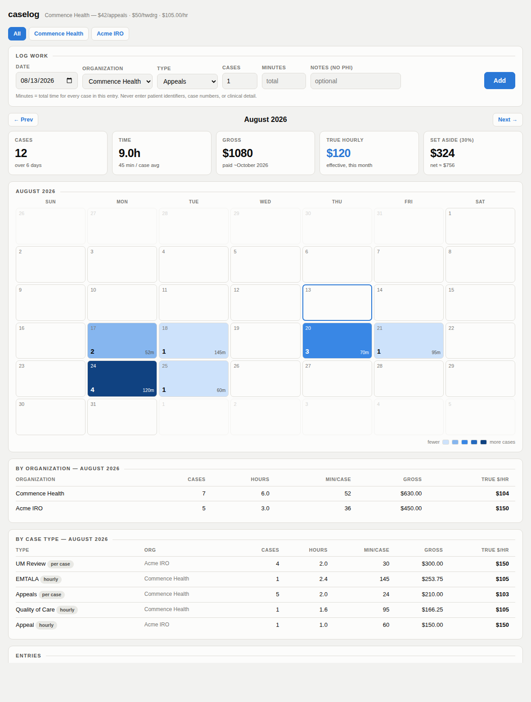
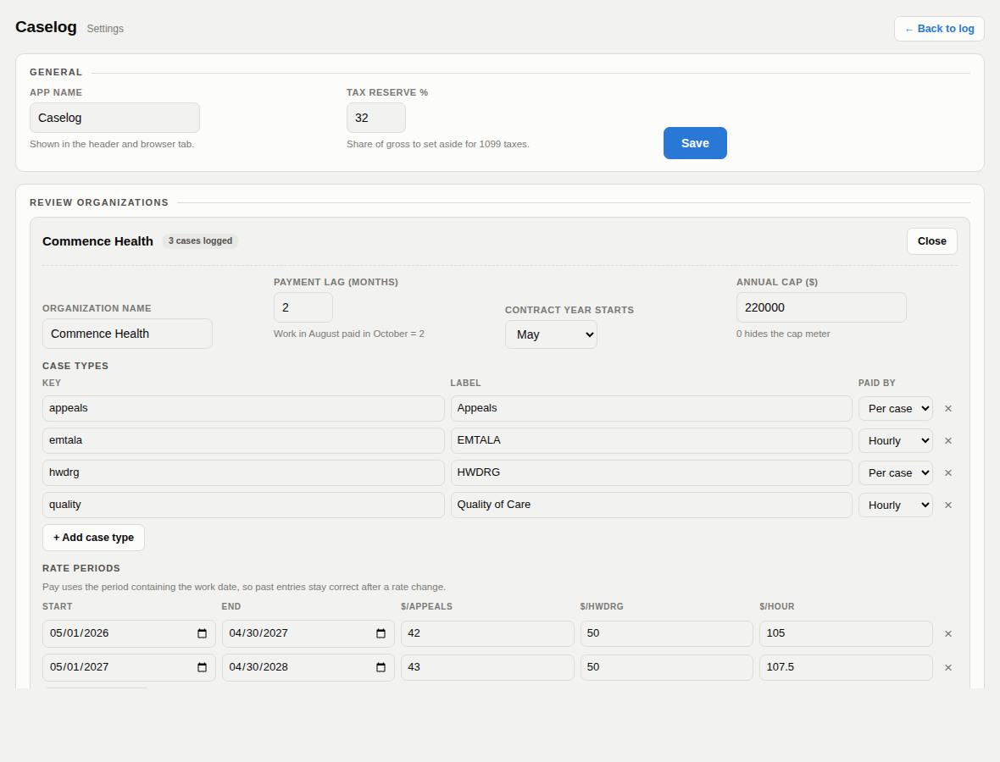

# caselog

Case and earnings tracker for physician reviewers.

Log how long each batch of case reviews takes, and caselog computes what it pays
against each review organization's contract rate schedule — then tells you the
number that actually matters: **your true effective hourly rate**.

Self-hosted, single container, SQLite. Everything is configured in the web UI.



---

## Why

Piecework rates hide the real number. A $42-per-case review pays $105/hour if it
takes 24 minutes and $63/hour if it takes 40. caselog tracks the minutes so you
can see which case types are worth your evenings — and whether you're getting
faster.

## Features

- **Per-case timing** → true effective hourly rate, by organization and case type
- **Multiple review organizations**, each with its own case types, rate periods,
  contract year, payment lag, and annual cap
- **Rate periods** — pay is computed with the rate in effect on the *work date*, so
  historical entries stay correct after a contract escalation
- **Calendar heatmap** of days worked and case volume
- **Expected payment month** from each organization's payment lag
- **Tax reserve** estimate for 1099 income
- **Contract-year totals** with annual cap tracking
- **CSV export** for taxes and records
- Light and dark themes; configured entirely in the browser

## No PHI

caselog stores dates, organization, case type, counts, minutes, and free-text
notes. **Nothing else.** Do not enter patient identifiers, case numbers tied to
beneficiaries, or clinical detail — reviewer agreements typically prohibit moving
case data outside the review platform, and this is not a place to put it.

---

## Install

### Unraid

| Setting | Value |
|---|---|
| Repository | `ghcr.io/emdoc12/caselog:latest` (or build locally) |
| Network Type | Bridge |
| Port | `8321` → `8080` |
| Path | `/mnt/user/appdata/caselog` → `/data` |
| Variable | `TZ` = your timezone |

`caselog.xml` in this repo is an Unraid Community Applications template.
The `/data` volume holds `caselog.db` — the only file to back up.

### Docker Compose

```yaml
services:
  caselog:
    image: caselog:latest      # or build: .
    container_name: caselog
    restart: unless-stopped
    ports:
      - "8321:8080"
    volumes:
      - ./data:/data
    environment:
      - TZ=America/New_York
```

```bash
docker compose up -d
```

### From source

```bash
git clone https://github.com/emdoc12/caselog.git
cd caselog
docker build -t caselog .
docker run -d -p 8321:8080 -v $PWD/data:/data --name caselog caselog
```

Then open `http://<host>:8321`.

---

## Configuration

All configuration lives on the **Settings** page — nothing needs to be set through
Docker beyond the port, the data volume, and `TZ`.



**General** — app name (shown in the header and browser tab) and the tax reserve
percentage used for the set-aside estimate.

**Review organizations** — add one per company you review for. Each has:

| Field | Meaning |
|---|---|
| Organization name | Display label |
| Payment lag (months) | Work in August paid in October = `2` |
| Contract year starts | Month the annual cap and year-to-date totals reset |
| Annual cap | Compensation ceiling; `0` hides the meter |
| Case types | A key, a label, and whether it's paid **per case** or **hourly** |
| Rate periods | Date range plus a rate for each per-case type and an hourly rate |

Rate periods are how contract escalations work: add a period per contract year and
caselog prices each entry using the period containing its work date, so last
year's entries keep last year's rates.

### Environment variables

Optional — the defaults are fine for most installs.

| Variable | Default | Purpose |
|---|---|---|
| `CASELOG_DB` | `/data/caselog.db` | SQLite path |
| `CASELOG_SECRET` | `caselog-local` | Flask session key (for flash messages) |
| `PORT` | `8080` | Listen port inside the container |
| `TZ` | `UTC` | Timezone used for "today" |

## Data

Everything — entries, organizations, and settings — lives in a single SQLite file
at `/data/caselog.db`. Copy it to back up. `GET /export.csv` produces a portable
snapshot for taxes.

An existing `orgs.json` from an earlier version is imported automatically on first
start.

## Endpoints

| Route | Purpose |
|---|---|
| `/` | Dashboard (`?m=YYYY-MM`, `?org=<key>\|all`) |
| `/settings` | Configuration UI |
| `/add`, `/delete/<id>` | POST — create / remove entry |
| `/export.csv` | Full history as CSV |
| `/healthz` | Health check (returns version) |

## Notes

- Pay figures are computed from the rates you configure and are **estimates**.
  Reconcile against the remittance advice you receive.
- Effective hourly rate is `gross ÷ hours`, so for per-case work it rises as you
  get faster and falls when a case runs long. That's the point.

## License

MIT
